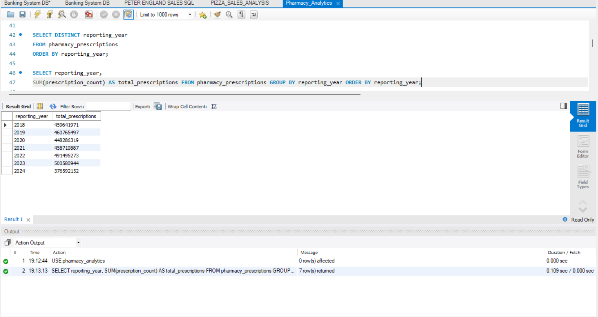
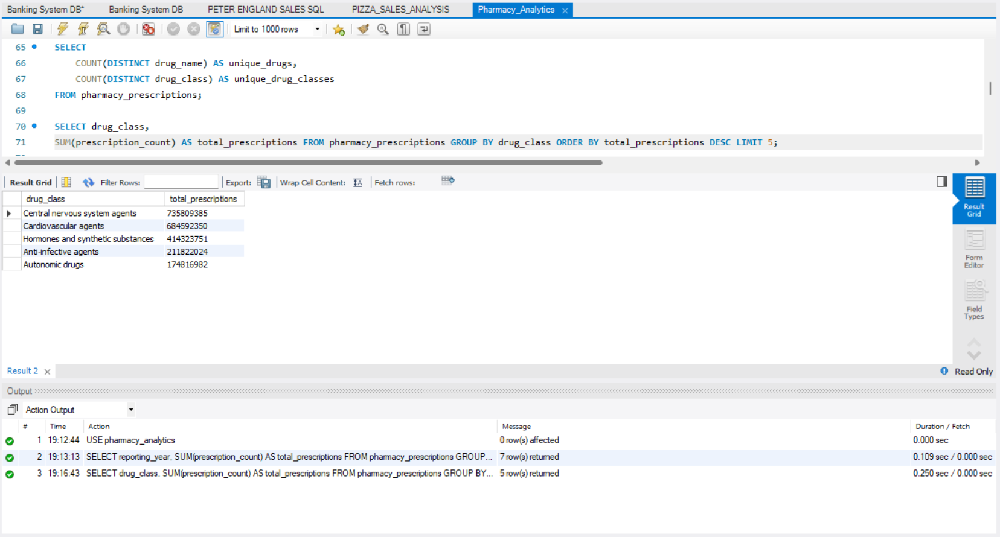
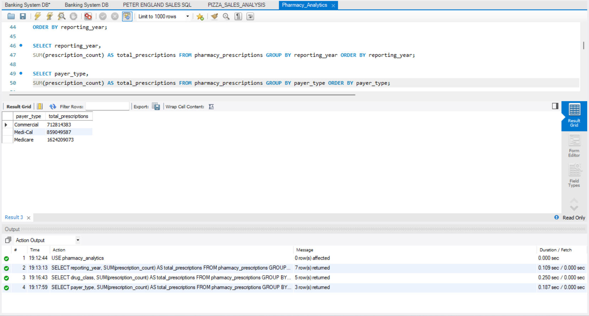
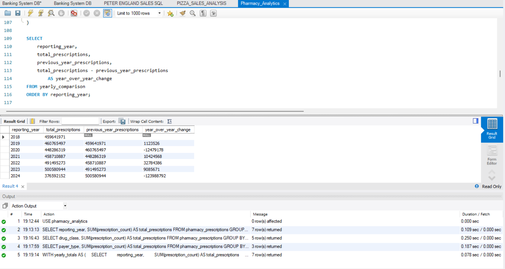

# Pharmacy Analytics using SQL

## 📌 Project Overview

This project analyzes pharmacy prescription data using **MySQL** to identify trends and patterns in prescription volumes, drug classes, payer types, and yearly performance.

The project focuses on applying SQL for data exploration, data quality checks, aggregation, and business-oriented analysis.

## 🎯 Objectives

- Analyze total prescription volumes
- Identify yearly prescription trends
- Analyze prescriptions by payer type
- Identify the most prescribed drug classes
- Analyze brand vs generic prescriptions
- Perform data quality and missing-value checks
- Calculate year-over-year prescription changes
- Calculate payer contribution percentages
- Identify unique drugs and drug classes

## 🛠️ Tools & Technologies

- MySQL
- MySQL Workbench
- SQL
- GitHub

## 📊 Dataset Structure

The main table used in this project is:

`pharmacy_prescriptions`

| Column | Description |
|---|---|
| `drug_name` | Name of the drug |
| `reporting_year` | Year of the prescription record |
| `drug_class` | Drug classification |
| `brand_generic` | Brand or generic classification |
| `payer_type` | Type of payer |
| `prescription_count` | Number of prescriptions |

## 🔍 Analysis Performed

### 1. Data Quality Analysis

Checked for missing values in:

- Drug name
- Reporting year
- Drug class
- Brand/generic classification
- Payer type
- Prescription count

### 2. Yearly Prescription Analysis

Calculated total prescriptions for each reporting year to identify prescription trends over time.

### 3. Payer Analysis

Analyzed prescription volumes by payer type and calculated each payer's percentage contribution to total prescriptions.

### 4. Drug Class Analysis

Identified the top drug classes based on total prescription volume.

### 5. Brand vs Generic Analysis

Analyzed the different brand/generic categories present in the dataset.

### 6. Prescription Statistics

Calculated:

- Minimum prescription count
- Maximum prescription count
- Total prescriptions
- Number of unique drugs
- Number of unique drug classes

### 7. Year-over-Year Analysis

Used **CTEs** and the **LAG() window function** to compare prescription volumes between consecutive years.

Calculated:

- Current year prescriptions
- Previous year prescriptions
- Year-over-year change
- Year-over-year percentage change

## 🧠 SQL Concepts Demonstrated

- SELECT
- DISTINCT
- COUNT()
- SUM()
- MIN()
- MAX()
- GROUP BY
- ORDER BY
- ROUND()
- Common Table Expressions (CTEs)
- Window Functions
- LAG()
- Percentage calculations
- Year-over-year analysis
- Data quality checks

## 📈 Business Questions

This project answers questions such as:

1. How many prescriptions are recorded?
2. How do prescription volumes change over the years?
3. Which payer types contribute the most prescriptions?
4. Which drug classes have the highest prescription volumes?
5. How many unique drugs are present?
6. How many unique drug classes are present?
7. What are the minimum and maximum prescription counts?
8. What is the year-over-year change in prescription volume?
9. What percentage of total prescriptions does each payer type represent?
10. Are there missing values in important fields?

## 📂 Project Structure

```text
pharmacy-analytics-sql/
│
├── README.md
│
├── sql/
│   └── Pharmacy_Analytics.sql
│


## 📸 SQL Analysis Screenshots

### Yearly Prescription Analysis



### Top Drug Classes



### Payer Analysis



### Year-over-Year Analysis



